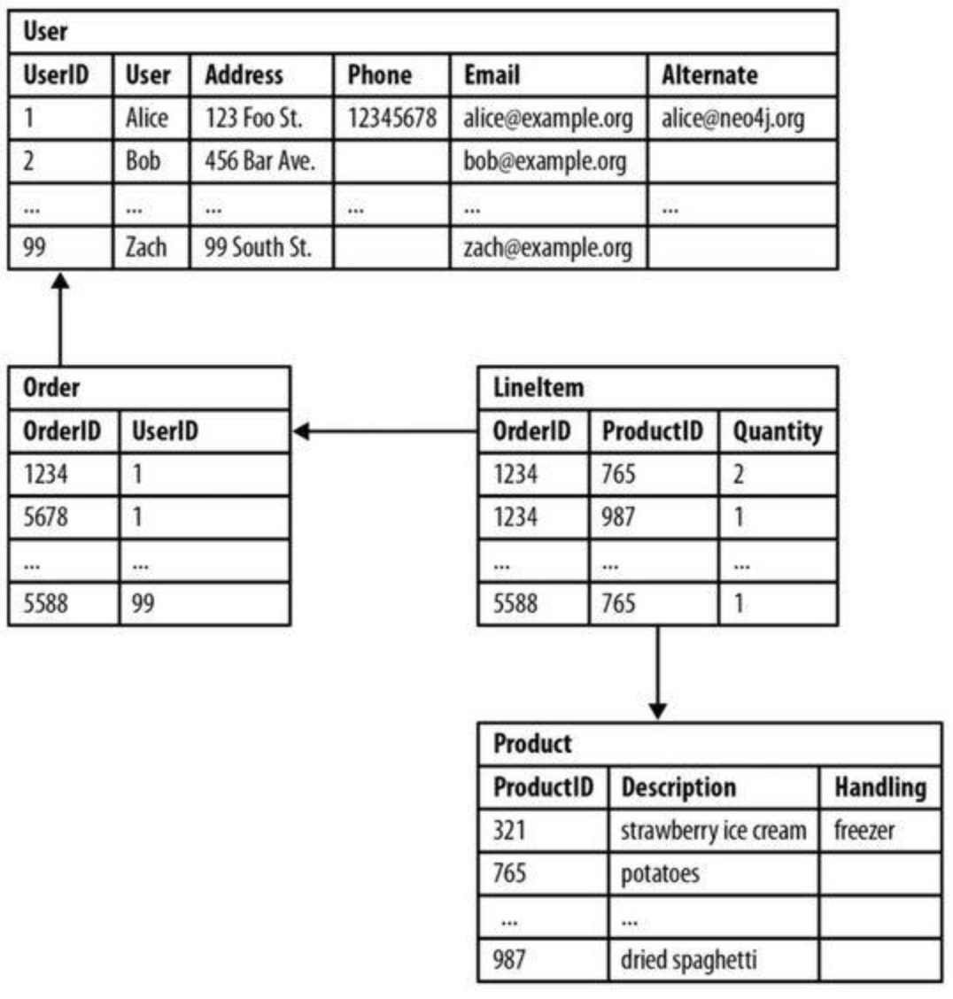
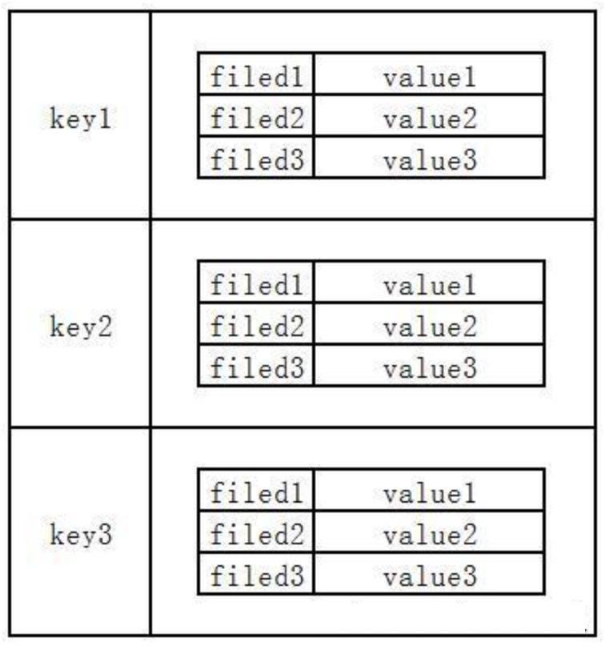
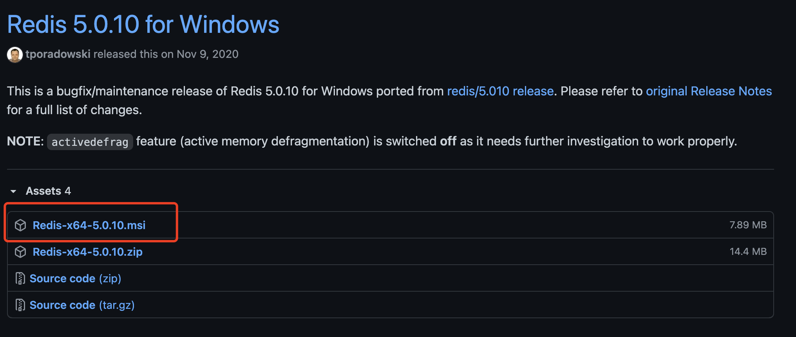
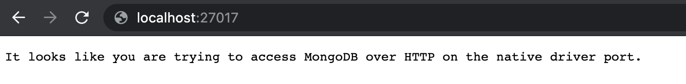
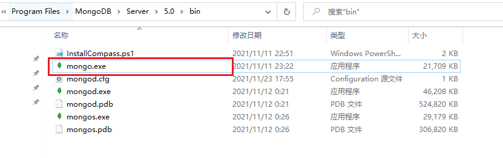

# NoSQL

# 非关系型数据库

## 关系型数据库（RMDB）介绍

**目标: 了解什么是关系型数据库**

关系型数据库，是指采用了 **关系模型** 来组织数据的数据库。

关系模型，指的就是 **二维表格模型**，而一个关系型数据库就是由 **二维表及其之间的联系** 所组成的一个数据组织。





关系型数据库一般都支持数据库事务，必须具备 `ACID` 特性。`ACID`分别是指：

- `Atomic ` 原子性  (事务操作要么全做完，要么都不做)
- `Consistency ` 一致性 (数据库要一直处于一致的状态  =>   完整性约束: a + b = 10)
- `Isolation` 隔离性 (并发的事务之间不会互相影响)  
- `Durability ` 持久性 (一旦事务提交, 修改将永久保存)

**优点**

1. 容易理解：二维表结构贴近逻辑，关系模型容易理解
2. 使用方便：通用的SQL语言操作方便
3. 易于维护：数据冗余和数据不一致的概率较低

**缺点**

1. IO瓶颈 : 

   网站并发性通常非常高(每秒上万次读写)，硬盘`I/O`是一个很大的瓶颈

2. 效率低下: 

   网站数据量是巨大，关系型数据库，查询效率是非常低的

3. 难以横向扩展:  

   没有办法像`web server`和 `app server `那样通过添加硬件和服务节点来扩展性能和负载能力。

   当需要进行升级和扩展时，往往需要停机维护和数据迁移。

**关系型数据库, 比较适合存储持久化的一些数据, 关系复杂的结构数据.        数据量特别大, 实时性要求高 =>非关系型**

**流行的关系型数据库**

- MySQL（开源）
- PostgreSQL（开源）
- Oracle（商业）
- SQL Server（商业）
- DB2（商业）
- ...

---


## 非关系型数据库（NoSQL）介绍

> 了解什么是非关系型数据库

非关系型数据库，是指非关系型的、分布式的、且一般不保证遵循 `ACID` 原则的数据存储系统。

非关系型数据库以**键值对**存储，且**结构不固定**，每一个元组可以有不一样的字段，每个元组可以根据需要增加一些自己的键值对，不局限于固定的结构，可以减少一些时间和空间的开销。





**优点**

1. 格式灵活：可以是：key-value 形式、文档形式、图片形式等，灵活, 应用场景广泛

2. 用户可以根据需要去添加自己需要的字段，为了获取用户的不同信息，无需多表进行关联查询。

   仅需要根据 `id` 取出相应的 `value` 就可以完成查询

3. 适用于SNS社交网络服务中，例如 Facebook、微博等。

   系统升级、功能增加等场景，往往意味着需要对数据结构的巨大变动，关系型数据库难以应付这一点

4. 速度快：NoSQL 可以使用硬盘或者随机存储器作为载体，而关系型数据库只能使用硬盘

5. 高扩展性

6. 成本低：NoSQL 数据库部署简单，且基本都是开源免费软件

**缺点**

1. 不提供 SQL 支持，学习和使用成本较高
2. 无事务处理
3. 只适合存储一些较为简单结构的数据，对于需要进行较复杂查询的数据，关系型数据库显的更为合适
4. 不适合  **持久** 存储海量数据

**流行的非关系型数据库**

- MongoDB
- Redis
- Cassandra
- CouchDB
- HBase
- Neo4J
- ...


---


## Redis & MongoDB

**非关系型数据库的分类**

虽然 NoSQL 数据库有很多，但是它们的功能也是有所差异的，在解决问题方面有所侧重。

因此 NoSQL 一般分为以下几类：

1. **文档型**

- 采用的数据模型是 key-value 键值对形式，且 value 是结构化的数据
- 强项：**它对数据结构的要求不严格**，结构化数据的结构可变，非常灵活，不需要像关系型数据库一样需要预定义数据的结构
- 弱项：查询性能不高，且缺乏统一的查询语法
- 应用场景：**用来存储 Web 应用中数据结构可能经常变化的数据**  (新闻,  热点,  用户喜好)
- 典型数据库：MongoDB、CouchDB


2. **key-value型**

- 采用的数据模型是 key-value 键值对形式，且 value 可以是字符串、二进制类型、或是键值对类型（通常使用Hash Table 实现）
- 强项：**查找速度非常快**
- 弱项：**数据无结构化**，通常只能存储字符串或二进制数据
- 应用场景：**通常可作为缓存来使用，用于处理大量数据的高访问负载**
- 典型数据库：Redis


3. 列式数据库（了解）

- 以列簇式存储，将同一列数据存储在一起
- 强项：查找速度快，可扩展性强，且更容易进行分布式扩展
- 弱项：功能相对比较局限
- 应用场景：作为分布式文件系统
- 典型数据库：Cassandra、HBase


4. 图形数据库（了解）

- 数据模型采用“图”结构
- 强项：利用图结构相关算法，可以实现如最短路径寻径、N度关系查找等功能
- 弱项：很多时候需要对整个图做计算才能得到需要的数据；而且图结构不方便做分布式的集群方案
- 应用场景：社交网络、推荐系统，主要专注于构建关系图谱
- 典型数据库：Neo4J


**Redis 介绍** (缓存)

Redis 是完全开源的，遵守 BSD 协议，是一个高性能的 key-value 数据库。

Redis 的优势：

- **性能极高** – Redis 能读的速度是110000次/s，写的速度是81000次/s
- 丰富的数据类型 – Redis 支持二进制案例的 Strings、Lists、Hashes、Sets 及 Ordered Sets 数据类型操作
- 原子 – Redis 的所有操作都是原子性的，意思就是要么成功执行要么失败完全不执行。单个操作是原子性的。多个操作也支持事务，即原子性，通过 MULTI 和 EXEC 指令包起来
- 丰富的特性 – Redis 还支持 publish/subscribe，通知，key 过期等等特性


**MongoDB 介绍** (可扩展高性能, 结构可变的数据存储方案)

MongoDB 是由C++语言编写的，是一个基于分布式文件存储的开源数据库系统。在高负载的情况下，添加更多的节点，可以保证服务器性能。**MongoDB 旨在为WEB应用提供可扩展的高性能数据存储解决方案。**

MongoDB 将数据存储为一个文档，数据结构由键值(key=>value)对组成。MongoDB 文档类似于 JSON 对象。字段值可以包含其他文档，数组及文档数组。


---


# 在 Koa 中使用 Redis (了解)

## Redis 的安装和使用

> 安装 Redis，以及对 Redis 的基本功能的使用

**安装**

Redis 的安装文件下载地址：https://github.com/tporadowski/redis/releases




安装完成后，可以运行 redis-server.exe 启动 Redis 服务器。 (安装, 一直下一步即可)

**数据操作**

运行 redis-cli.exe，打开 Redis 的命令行客户端。


操作一：向 Redis 中存储一个字符串键值对

```bash
set key1 hello   # 存入一个键值对，键为 key，值为字符串 hello
```

操作二：从 Redis 中获取某个键值对值

```bash
get key1     		# 得到字符串 hello
```

操作三：查看 Redis 中所有的键值对 key

```bash
keys *          
```

操作四：向 Redis 中设置一个数字并自增

```bash
incr mynum        # mynum 为 1
incr mynum        # mynum 为 2

get mynum         # 查看 mynum 结果为 2
```

[【更多操作参考操作命令手册】](http://doc.redisfans.com/)

---


## 在 Koa 中连接 和 调用 Redis

> 掌握从 Koa 代码中连接 Redis 服务器并操作 Redis 中的数据

**使用步骤**

1. 安装 Redis 驱动包

目前主流的 Node.js 的 Redis 驱动包有两个：[node-redis](https://github.com/noderedis/node-redis/) 和 [ioredis](https://github.com/luin/ioredis#readme)，这两个包都有性能非常高、使用方便的特点。而后者的性能更好、功能更强大。

```bash
npm i ioredis
```

2. 在 koa 中使用 ioredis 连接 Redis 服务器，并发送数据操作命令

```js
const Koa = require('koa')

// 1. 引入 ioredis
const Redis = require('ioredis')

// 2. 创建 Redis 客户端实例，指定要连接的 Redis 服务器
const redis = new Redis({
    port: 6379,         // redis 服务器的默认端口
    host: '127.0.0.1'   // redis 服务器的 IP 地址
})

const app = new Koa()

app.use(async ctx => {
    // 通过客户端实例，向 Redis 服务器发送数据操作命令，进行相关操作
    //（这等价于在命令行窗口中输入命令进行操作）
  
  	// 1) 设置数据
    await redis.set('my_key1', 'hello,world')
    await redis.set('my_key2', 'foo,bar')
    await redis.incr('my_num')
  
    // 2) 获取数据
    const myKey1Value = await redis.get('my_key1')
    console.log(myKey1Value)

    ctx.body = '完成'
})

app.listen(3000)
```


---


# 在 Koa 中使用 MongoDB

## MongoDB 的安装

> 掌握 MongoDB 服务器软件的安装和启动

**安装**

MongoDB下载地址：https://www.mongodb.com/try/download/community

下载安装好以后，启动 MongoDB 服务器:

1. 新建一个数据文件目录，比如 C:\data\db
2. 执行命令进行启动 (**先配环境变量** => 让系统知道有这么个目录)

```bash
mongod --dbpath=C:\data\db

# mongod 为 MongoDB 的服务器程序
# 数据文件目录默认为 /data/db
```

**验证**

MongoDB 服务器启动后，访问 http://localhost:27017，如果出现这样的结果则表示已经成功：



---


## MongoShell 操作数据库

- mongo Shell 是 MongoDB 官方提供的一个在命令行中用来连接操作 MongoDB 服务的客户端工具
- 使用 mongo Shell 可以对 MongoDB 数据库进行数据的管理



命令演示:

- show dbs   查看数据库

- db  查看当前数据库

- use database  切换数据库

- show collections  查看集合列表

  ...

```js
插入数据演示:
	db.users.insert({ name: 'Jack', age: 18 })
	
检索查看数据:
	db.users.find()
```


## MongoDB 基础概念

MongoDB中的数据存储结构:

- 数据库 database
- 集合 collection (一个集合存一类数据)
- 文档 document (集合中的一项)
- 数据字段 field

MongoDB是文档型数据库, 存储的都是一些 JSON 格式数据

```js
{
  // 数据库 database
  "test1": {
    // 集合 collection
    "users": [
      // 文档 document
      {
        // 数据字段 field
        "id": 1,
        "username": "小明",
        "password": "123456"
      },
      {
        "id": 2,
        "username": "小王",
        "password": "123456",
        "desc": "不错"
      }
      // ...
    ],
    "teachers": [
      {
        "id": 1,
        "name": "李老师"
      },
      {
        "id": 2,
        "name": "王老师",
      }
    ]
  },

  // 数据库
  "test2": {}

  // ...
}
```


### 数据库相关

- 查看数据库列表:  

```js
show dbs
```

- 查看当前数据库:

```js
db
```

- 创建/切换数据库:   (数据库只有真正的有了数据才会被创建出来)

```js
use 数据库名
```

- 删除当前数据库: 

```js
db.dropDatabase()
```


### 集合相关

- 创建集合: 只需要往集合中插入数据, 集合会自动创建

```js
db.集合名.insert({ name: 'zs', age: 18 })
```

- 查看集合

```js
show collections
```

- 删除集合

```js
db.集合名称.drop()
```


### 文档相关

- MongoDB 将数据记录存储为 BSON 文档
- BSON（Binary JSON）是 JSON 文档的二进制表示形式，它比 JSON 包含更多的数据类型

- [BSON 规范](http://bsonspec.org/)

- 字段名称 `_id` 保留用作主键；它的值在集合中必须是唯一的，不可变的，并且可以是数组以外的任何类型。

```js
> db.users.find()
{ "_id" : ObjectId("619cc474cc1980baa07f2c24"), "name" : "Jack", "age" : 18 }
```


## MongoDB - 增删改查

可视化操作工具: 

- MongoDB Compass               官网地址 : https://www.mongodb.com/zh-cn/products/compass
- navicat                                        官网地址:  http://www.navicat.com.cn/

### 创建文档 (增)

```js
db.集合名.insertOne({ ... }) 插入一个

db.集合名.insertMany([{ ... }, { ... }]) 插入多个

db.集合名.insert({ ... }) 插入一个或多个
```

### 查询文档 (查)

```js
db.集合名.find()  查询所有

db.集合名.find().pretty()  查询并格式化

db.集合名.find(查询条件, { 键: 0/1 })   0表示排除, 1表示包含  
```

相等条件

```js
db.集合名.find({
  键: 值
})
```

AND 条件

其他查询运算符: https://docs.mongodb.com/manual/reference/operator/query-comparison/

```js
db.集合名.find({
  键: 值,
  键: 值,
  键: {
  	$lt: 值
  },
  键: /\d/
})
```

OR 条件

```js
db.集合名.find({
  $or: [
  	{ 键: 值 },
  	{ 键: 值 }
  ]
})
```

### 更新文档 (改)

```js
// 更新第一个满足条件的项
db.集合名.updateOne(查询条件, {
	$set: {
		键: 值,
		键: 值
	}
})

// 更新所有满足条件的项
db.集合名.updateMany(查询条件, {
	$set: {
		键: 值,
		键: 值
	}
})
```

### 删除文档 (删)

```
db.collection.deleteMany(查询条件)

db.collection.deleteOne(查询条件)
```


## 在 Koa 中连接和调用 MongoDB

> 掌握从 Koa 代码中连接 MongoDB 服务器，并简单往 MongoDB 中插入一条数据

### 构建基本架子

1. 安装 mongodb 驱动包

[mongodb](https://www.npmjs.com/package/mongodb) 是官方提供的 Node.js 驱动包，可以连接 MongoDB 服务器，并通过发送命令来实现对 MongoDB 服务器的各种操作。

```bash
yarn add mongodb koa @koa/router
```

2. 创建 db 模块,  使用 mongodb 驱动包连接 MongoDB 服务器

```js
// 1. 引入 mongodb 驱动包
const mongodb = require('mongodb')
const MongoClient = mongodb.MongoClient

// 2. 创建 MongoDB 客户端实例
// MongoDB 服务器的连接地址，其中可包含用户名、密码、域名、端口、数据库名等信息
const mongoClient = new MongoClient('mongodb://127.0.0.1:27017')

// 3. 建立连接
mongoClient.connect()

// 4. 连接关联哪个数据库
const db = mongoClient.db('classroom')

module.exports = db
```

3. 创建路由模块

```js
const Router = require('@koa/router')

const router = new Router()

router.get('/', async ctx => {
  ctx.body = '这是首页'
})
router.get('/list', async ctx => {
  ctx.body = '这是列表'
})

module.exports = router
```

4. 挂载路由

```js
const Koa = require('koa')
const router = require('./router')
const app = new Koa()
app.use(router.routes())
app.listen(8888, () => console.log('服务器启动成功...'))
```

### 执行添加操作

```js
const Router = require('@koa/router')
const db = require('./db')
const router = new Router()

router.get('/', async ctx => {
  ctx.body = '这是首页'
})
router.get('/list', async ctx => {
  ctx.body = '这是列表'
})
router.get('/add', async ctx => {
  const collection = db.collection('students')

  const info = await collection.insertOne({ name: 'Tom', age: 18 })
  console.log(info)

  collection.find().forEach(item => {
    console.log(item)
  })

  ctx.body = '操作完成'
})

module.exports = router
```

---


## 在 Koa 中对 MongoDB 数据进行增删改查

> 掌握从 Koa 代码中对 MongoDB 的数据做增、删、改、查操作

**新增数据**

向 MongoDB 中的某个 collection 内新增一条或多条数据，可以使用以下方法：

```js
// 新增一条
await collection.insertOne({ name: 'Tom', age: 18 })

// 新增多条
await collection.insertMany([
  { name: 'Jack', age: '28' },
  { name: 'Marray', age: '21' },
])
```

默认情况下，新增后的每条数据都会自动被添加上一个：类型为 ObjectID、字段名为 `_id` 的唯一标识。


**删除数据**

要删除某个 collection 中的指定 `_id` 数据，可以使用：

```js
const mongodb = require('mongodb')
const ObjectID = mongodb.ObjectID

collection.deleteOne(
 	// 查询条件
  {
    _id: ObjectID('....ID的值.....')
  }
)
```


**修改数据**

如果要对某个 collection 中的某些数据进行更新，可以使用 `updateOne` 或 `updateMany` 方法：

```js
await collection.updateOne(
  // 查询条件
  {
    _id: ObjectID('60bc8eb33e941a0a20875e0d')
  }, 

  // 更新表达式选项
  {
    $set: { name: '张三' }
  }
)
```


**查询数据**

将某些符合查询条件的数据从 collection 中查找出来，可以使用 `find` 方法：

```js
const users = await collection.find(
  // 查询条件
  {
    // age 字段值 大于 15
    age: {
      $gt: 15
    }
  }
)
```

查询结果为游标类型（Cursor），不能直接用 for 循环等遍历，可以使用它的 `forEach` 方法遍历，或先将它转为数组：

```js
// 用 forEach 方法遍历
users.forEach(user => {
  console.log(user);
})

// 先转为数组后再用 for 循环遍历
const arr = await users.toArray()
for (const item of arr) {
  console.log(item)
}
```


## MongoDB配置用户名和密码进行认证登录

查看目前MongoDB中的所有用户

```js
use admin

show users
```

### 创建管理员用户

```
db.createUser({ user: 'root', pwd: '123456', roles: ["root"]})
```

重新打开cmd，在mongodb路径的bin目录下，执行

```js
mongod --dbpath=C:\data\db  --auth  (data是安装mongodb创建的数据库文件夹)
```

