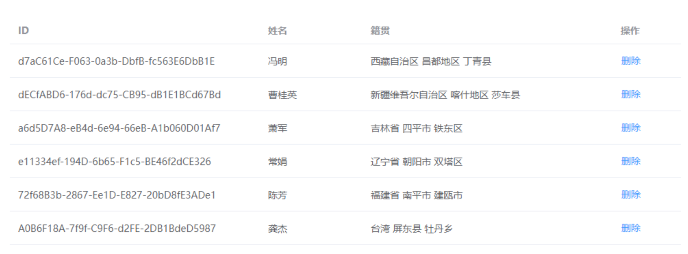

# 综合案例

## 基础准备{#case-pre}
> 初始化代码安装element-plus组件库
- 克隆代码 `git@gitee.com:zhoushugang/vue3-demo-template.git`

```bash
git clone git@gitee.com:zhoushugang/vue3-demo-template.git
```

成功之后：
```bash
cd vue3-demo-template
yarn 
yarn dev
```

- 模板代码分析

安装 element-plus
```bash
yarn add element-plus
```
使用 element-plus
```diff
import { createApp } from 'vue'
import App from './App.vue'

+// element-plus 支持vue3的ui组件库，使用和element-ui一致 
+import ElementUI from 'element-plus'
+import 'element-plus/dist/index.css'
+// use(ElementUI) 使用组件库
+createApp(App).use(ElementUI).mount('#app')
```


- 需求说明，使用组合式API实现
  - 列表渲染
  - 删除数据

## 实现功能{#case-complete}

```vue
<script setup>
import { onMounted, ref } from "vue";
import axios from 'axios'
// 获取列表数据
const list = ref([])
const geList = async () => {
  const res = await axios.get('/list')
  list.value = res.data
}

onMounted(() => {
  geList()
})

// 删除数据
const delRow = async (id) => {
  await axios.delete(`/del?id=${id}`)
  geList()
}
</script>
<template>
  <div class="app">
    <el-table :data="list">
      <el-table-column label="ID" prop="id"></el-table-column>
      <el-table-column label="姓名" prop="name" width="150"></el-table-column>
      <el-table-column label="籍贯" prop="place"></el-table-column>
      <el-table-column label="操作" width="100">
        <template v-slot="{ row }">
          <el-button type="primary" link @click="delRow(row.id)">删除</el-button>
        </template>
      </el-table-column>
    </el-table>
  </div>
</template>
<style>
.app {
  width: 980px;
  margin: 100px auto 0;
}
</style>
```
